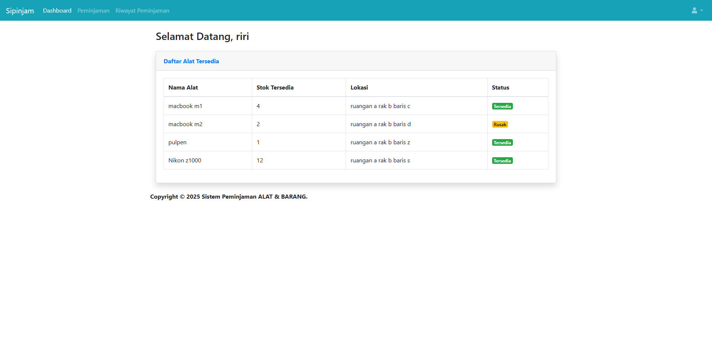
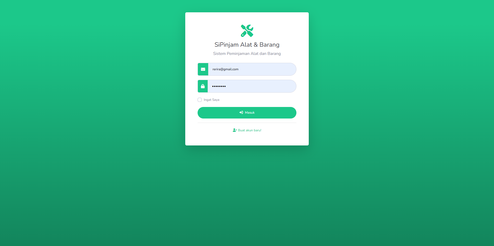
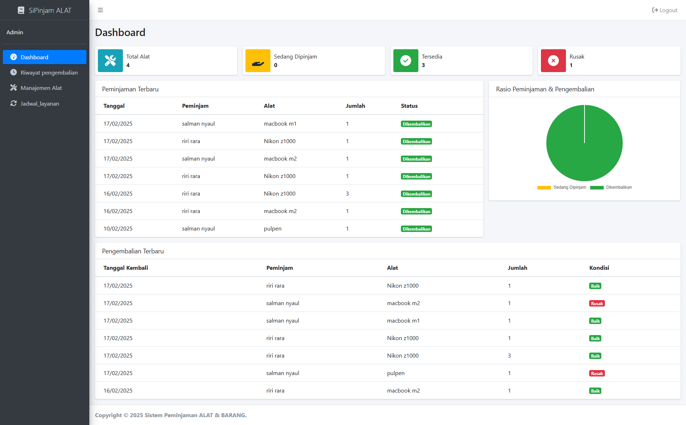

# Sistem Peminjaman Barang dan alat

## Deskripsi

Sipinjam alat dan barang ini merupakan aplikasi berbasis web yang digunakan untuk mengelola peminjaman dan pengembalian barang dengan fitur utama pengaturan lokasi penyimpanan barang dan riwayat peminjaman. Aplikasi ini memudahkan pengguna dalam melacak barang yang dipinjam serta mengelola tempat penyimpanannya secara efisien.
## Fitur Utama

- **Manajemen Tempat/Lokasi Barang**: Admin dapat mengatur lokasi penyimpanan barang agar mudah ditemukan.
- **Peminjaman Barang**: Pengguna dapat meminjam barang yang tersedia dalam sistem.
- **Pengembalian Barang**: Barang yang sudah dipinjam dapat dikembalikan dan diperbarui statusnya.
- **Riwayat Peminjaman/Pengembalian**: Pengguna dapat melihat daftar barang yang pernah dipinjam dan dikembalikan.
- **Manajemen Barang**: Admin dapat menambah, menghapus, atau memperbarui data barang.

## Teknologi Yang Digunakan

- PHP (CodeIgniter 3)
- MySQL
- Bootstrap 4
- DataTables JQuery

## Gambar
=======

